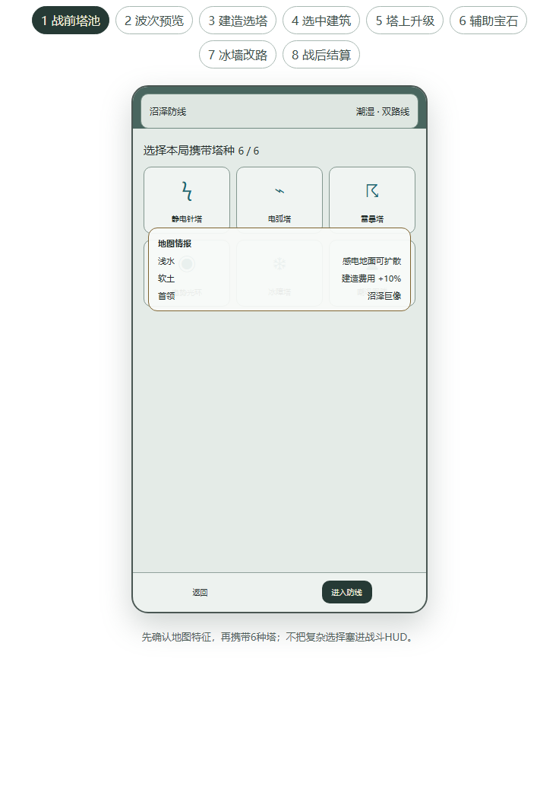

# POETower DEMO 体验与交互策划案 v1

更新时间：2026-08-13
状态：DEMO 体验与交互基线
适用范围：竖屏 2D 塔防垂直切片

## 0. 文档定位

本文负责回答“玩家如何从进入游戏走到一局结算，以及每一步看到什么、能做什么、如何得到反馈”。

- 内容边界以 [`demo_scope.md`](demo_scope.md) 为准。
- 塔、敌人、波次和初始数值以 [`demo_content_catalog.md`](demo_content_catalog.md) 为准。
- 建造、升级、金币和局内状态以 [`systems/run_and_build_rules.md`](systems/run_and_build_rules.md) 为准。
- 战斗结算、状态积累和辅助宝石以 [`systems/combat_skill_modifier_spec.md`](systems/combat_skill_modifier_spec.md) 为准。
- 网格、冰墙、动态寻路和地面效果以 [`systems/grid_navigation_terrain_spec.md`](systems/grid_navigation_terrain_spec.md) 为准。
- 本文新增并确认 UI 规则：**建造网格默认隐藏，只在建造模式及其放置子状态中显示。**

若本文与玩法系统文档冲突，玩法规则服从系统文档；界面流程和信息呈现服从本文。

## 1. 一句话体验

玩家以建筑师身份携带一套电系塔阵进入沼泽，在战斗中用有限金币不断建造、升级和重构多座塔，通过“施加感电—利用感电—消耗感电—光环强化”的联动抵挡九波怪物，并将胜利战利品带回据点。

## 2. DEMO 要验证的问题

### 2.1 核心验证

1. 多塔协作是否比堆叠单一塔更有效、更容易理解。
2. 玩家能否在不中断战场观察的情况下，通过塔上 TIPS 完成升级、辅助宝石和出售。
3. 建造网格按需显示后，战斗画面是否更干净，同时仍能准确放置塔。
4. 九波金币供给是否持续制造“扩建塔阵”与“强化现有塔”的有效选择。
5. 冰墙改路、浅水感电和嘲讽是否能证明“地图也是构筑组件”。

### 2.2 成功门槛

- 新玩家在 3 分钟内独立完成一次建造、威力升级、辅助宝石安装和出售。
- 玩家在第一局结束前能说出静电针、电弧和雷暴在电系循环中的不同职责。
- 玩家不会把常规战斗状态中的建筑区域误认成必须持续操作的棋盘。
- 玩家能在点击前预判建造、升级、出售和冰墙放置的成本或结果。
- 完成一次胜利和一次失败后，玩家能解释战利品为何保留或丢失。

## 3. DEMO 范围

### 3.1 必须包含

- 竖屏 1080×1920 设计基准，最低验证窗口 540×960。
- 1 张沼泽地图：上方怪物战区，下方自由建造区。
- 6×8 战区导航网格、6×4 建造网格、至少两条可替代路线。
- 9 波战斗：7 普通波、1 精英波、1 首领波。
- 6 种出战塔全部初始解锁并固定携带。
- 单座塔独立威力等级、最多 5 颗辅助宝石、每塔 10 个候选。
- 局内金币、局末清零、击杀即时入账。
- 电系状态联动、光环强化、冰墙改路、冰缓地面和持续时间嘲讽。
- 胜利提交战利品，失败或主动退出丢失本局临时战利品。

### 3.2 本阶段不做

- 建筑师主动技能。
- 森林、城市正式关卡与终局结构。
- 战斗中更换建筑师装备或天赋。
- 飞行敌人、随机地图、联网、交易和赛季系统。
- 复杂跨元素地面反应；DEMO 只验证浅水与感电/冰缓联动。

## 4. 完整玩家流程

```text
启动游戏
→ 据点主菜单
→ 查看并锁定建筑师装备/天赋
→ 选择本局携带的 6 种塔
→ 查看沼泽地图特征与九波摘要
→ 进入波次预览
→ 进入建造模式并布置初始塔阵
→ 开始战斗
→ 击杀获得金币
→ 建造新塔 / 点选塔升级 / 安装辅助宝石 / 出售重构
→ 使用冰墙改路与嘲讽控制危险敌人
→ 波间调整
→ 第九波首领战
→ 胜利提交战利品或失败丢失临时战利品
→ 返回据点并调整下一局构筑
```

### 4.1 单波节奏

```text
波次预览 5～12 秒
→ 玩家主动开波或倒计时结束
→ 45～75 秒战斗
→ 2～4 秒清场与战报
→ 8～20 秒波间调整
→ 下一波
```

预期单局时长为 12～18 分钟；首局可因教学提示延长至 20 分钟。

### 4.2 全流程效果图



完整原版包含“战前塔池、波次预览、建造选塔、选中建筑、塔上升级、辅助宝石、冰墙改路、战后结算”八个可切换步骤：

[打开原版八步交互流程](../assets/ui/poe-tower-ui-flow.html)

## 5. 战斗界面信息架构

### 5.1 常驻层

常规战斗画面只保留三类常驻信息：

1. 顶部状态栏：城墙生命、当前波次、金币。
2. 战场与塔实体：怪物、路径、地面效果、已建塔和关键技能反馈。
3. 底部轻量操作栏：建造、波次、开始/继续、暂停、速度。

常驻层不得显示完整塔池、升级按钮、出售按钮、辅助宝石列表或空白建造格。

### 5.2 临时交互层

- 点击“建造”：显示建造网格和塔池抽屉。
- 点击已建塔：在该塔上方显示塔上 TIPS。
- 点击 TIPS 的“升级”：显示锚定于该塔的升级分支面板。
- 点击“辅助”：显示该塔的 10 个候选辅助宝石。
- 选择冰墙构造：显示战区放置格、旧路线和新路线预览。
- 胜负产生：显示全屏结算层。

同一时间只允许一个主要临时交互层存在。

## 6. UI 交互状态机

| UI 状态 | 进入方式 | 建造格 | 底部塔池 | 塔上信息 | 战斗模拟 | 退出方式 |
|---|---|---|---|---|---|---|
| `Default` | 进入战场、完成/取消操作 | 隐藏 | 隐藏 | 隐藏 | 按局内状态推进 | 点击建造、塔或其他操作 |
| `BuildPlacement` | 点击“建造” | 显示 | 显示 | 隐藏 | 继续推进 | 放置成功、取消、切换模式 |
| `TowerSelected` | 点击已建塔 | 隐藏 | 隐藏 | 基础 TIPS | 继续推进 | 点空白、选另一塔、进入子面板 |
| `TowerUpgrade` | 点击 TIPS“升级” | 隐藏 | 隐藏 | 升级面板 | 继续推进 | 完成、返回、点空白 |
| `SupportSelect` | 点击 TIPS“辅助” | 隐藏 | 隐藏 | 宝石面板 | 继续推进 | 安装/升级、返回、点空白 |
| `IceWallPlacement` | 从冰障塔选择构造 | 只显示战区目标格 | 隐藏 | 构造提示 | 继续推进 | 放置成功、取消、来源塔失效 |
| `Paused` | 点击暂停 | 保持暂停前状态 | 保持 | 保持 | 停止 | 再次点击暂停 |
| `Result` | 胜利或失败 | 隐藏 | 隐藏 | 隐藏 | 停止 | 结算确认 |

### 6.1 强制互斥规则

- 开启建造模式时，关闭塔上 TIPS、升级面板、宝石面板和冰墙预览。
- 点选已建塔时，退出建造模式并立即隐藏空白建造格和塔池抽屉。
- 打开升级或辅助面板时锁定当前塔；塔被出售或失效时自动关闭面板。
- 进入结算时无条件清空所有临时 UI 状态。
- 暂停只冻结模拟，不冻结 UI；执行权限仍服从局内阶段规则。

## 7. 八步界面流程

### 7.1 战前塔池

- 显示地图名称、生态标签、路径特征和关键敌人预告。
- 显示 6 个携带槽；DEMO 中 6 种塔全部可用。
- 所有塔初始解锁，但数据保留 `Default / Drop / Condition` 解锁来源。
- 装备和天赋在进入关卡时生成只读快照，本局不可更换。
- 未满基础携带数、存在重复塔或非法 ID 时禁止进入。

### 7.2 波次预览

- 顶部显示城墙生命、波次 `1/9` 和金币 `300`。
- 战场显示敌人入口、城墙目标、主要路线、浅水和软土地形。
- 底部只显示五个常驻操作。
- 下方建造区显示地形和已建塔，但**不显示空白格线**。
- 波次摘要显示敌人类型、数量级、精英/首领提示和应对标签，不直接给出唯一答案。

### 7.3 建造选塔

1. 玩家点击底部“建造”。
2. 建造区淡入 6×4 网格；合法、受地形影响、被占用和非法格使用图形/纹理区分。
3. 底部塔池抽屉展开，展示携带塔、实际费用和可建状态。
4. 选择塔后显示占地、射程、光环/相邻关系、地形修正和合法性预览。
5. 点击合法格提交建造命令。
6. 成功后扣款、生成塔、播放落成反馈，并退出建造模式。

DEMO 默认每次成功建造后退出模式，以保持战斗画面干净。取消方式包括再次点击建造、点击关闭、点选已建塔、切换其他模式或按返回键。

### 7.4 选中建筑

- 点击已建塔后，高亮塔底座并显示射程或影响范围。
- TIPS 锚定在塔上方，包含塔名、威力等级、关键节奏、升级、辅助、出售。
- 金币不足的操作保留显示但置灰，并显示缺少金币数。
- TIPS 不得遮挡当前塔、金币、城墙生命和主要敌人路径。
- 上方空间不足时翻转到塔下方；仍冲突时左右偏移并保留来源指针。
- 点击空白关闭；点击另一座塔直接切换锚点和内容。

### 7.5 塔上升级

升级面板包含两个入口：

- **提升威力**：塔等级从 1 提升至 5，展示升级前后关键数值。
- **安装辅助**：进入该塔独立的技能改造选择，显示 `x/5`。

威力升级基础费用：升至 2/3/4/5 级分别为 80/140/220/320 金币。最终费用受装备、天赋和地形修正，但不得低于基础值的 50%。

执行前显示实际费用、改变属性、受影响技能和规则变化。成功后数字滚动、塔身短促强化闪光，下一次技能释放开始采用新配置。

### 7.6 辅助宝石

- 每座塔固定展示配置关系中的 10 个候选。
- 单座塔最多安装 5 个不同 ID 的宝石；单颗最高 3 级。
- 同类塔实例之间不共享安装和等级。
- 安装第 1～5 颗基础费用为 40/60/90/130/180 金币。
- 单颗宝石升至 2/3 级基础费用为 90/160 金币。
- 选中候选时显示收益、代价、行为变化和升级后关键数值。
- 安装成功后留在当前面板，便于继续配置；点空白或返回才关闭。
- 复制同类塔配置执行前一次性计算总费用；任一项非法则整体拒绝。

### 7.7 冰墙改路

1. 玩家点选冰障塔，在 TIPS 中选择“放置冰墙”。
2. 下方建造空格保持隐藏，只显示战区可指定格和来源塔有效范围。
3. 指向格子时同时显示旧路线、新路线和禁止封死提示。
4. 合法放置后生成持续 6 秒的冰墙，怪物共享新导航场绕行。
5. 非法放置返回稳定错误码，状态、冷却和路线均不改变。

默认参数：每座冰障塔独立 18 秒冷却、同时 1 段、全场最多 2 段，不额外消耗金币。

### 7.8 战后结算

胜利结算显示：9 波完成、城墙剩余生命、总击杀、用时、各塔贡献、电系循环贡献、临时战利品和提交结果。

失败结算显示：失败波次、突破敌人、主要失败原因、临时战利品丢失提示，以及“重试相同配置”和“返回据点调整”。

## 8. 六塔与塔阵策略

| 塔 | 基础费用 | 核心职责 | 主要联动 |
|---|---:|---|---|
| 静电针塔 | 80 | 高频施加感电 | 为电弧与雷暴准备状态 |
| 电弧塔 | 100 | 连锁清杂 | 利用感电和潮湿提高覆盖 |
| 雷暴塔 | 120 | 消耗感电、范围爆发 | 生成感电地面并完成循环 |
| 电势光环塔 | 140 | 强化局部电系塔阵 | 提升积累与释放速度 |
| 冰障塔 | 130 | 临时改路与冰缓 | 延长塔阵输出窗口 |
| 嘲讽图腾塔 | 120 | 持续时间嘲讽 | 聚怪、减轻突破压力 |

### 8.1 首局推荐但不强制的塔阵

1. 在入口后段建造 1 座静电针塔。
2. 在分叉覆盖位置建造 1 座电弧塔。
3. 在怪物密集停留区建造 1 座雷暴塔。
4. 用电势光环覆盖其中至少两座电系塔。
5. 在危险波次用冰墙延长路线，或用嘲讽图腾稳定聚怪。

## 9. 战斗、控制与地图联动

### 9.1 电系核心循环

```text
静电针快速积累感电
→ 电弧利用已感电目标扩大连锁
→ 雷暴消耗感电获得爆发
→ 雷暴生成感电地面
→ 后续敌人进入地面后更容易接入循环
→ 电势光环提升整个局部塔阵的循环频率
```

状态反馈必须同时包含图标和积累条或层数，不能只靠颜色。

### 9.2 控制与地形

- 图腾不可被攻击；嘲讽按持续时间生效，不永久改变目标选择。
- 敌人可受到眩晕、冰冻、减速；抗性和持续时间由配置决定。
- 浅水强化电系状态扩散，并与冰缓形成地图联动。
- 泥地、软土和不可通行地形影响移动、建造成本或合法性。
- 冰墙是临时硬阻挡，必须保留至少一条可达路径。
- 普通敌人不会主动避开感电或冰缓地面。
- 召唤塔属于未来内容；召唤物只攻击、不承伤，本 DEMO 不生产对应塔。

## 10. 波次与经济

### 10.1 金币规则

- 开局金币 300；怪物死亡时即时自动入账。
- 金币只用于本局建造、升级、宝石安装/升级和配置复制。
- 局末金币清零，下局从固定基础值及局外修正重新开始。
- 出售返还累计实际投入的 70%，最终返还率钳制在 0%～100%。

### 10.2 九波目标收入

| 波次 | 目标击杀收入 | 累计理论资金（含开局） | 期望决策 |
|---|---:|---:|---|
| 1 | 80 | 380 | 补齐三塔循环或第一次升级 |
| 2 | 110 | 490 | 控制与清杂选择 |
| 3 | 140 | 630 | 安装首批辅助宝石 |
| 4 | 170 | 800 | 建造光环或冰障塔 |
| 5 | 210 | 1010 | 强化感电循环 |
| 6 | 250 | 1260 | 针对精英调整单塔配置 |
| 7 | 300 | 1560 | 扩建或集中投资 |
| 8 | 360 | 1920 | 首领前整备 |
| 9 | 战中小计 100 | 2020 | 首领战应急调整 |

实际配置总收入相对目标偏差超过 ±5% 时，内容校验应报错。

## 11. 输入、反馈与表现

### 11.1 输入原则

- 核心操作以单击/单次触摸完成，不依赖悬停获取必要信息。
- 点击空白等价于返回上一层临时交互状态。
- 只有出售和主动退出需要二次确认。
- 所有拒绝使用稳定错误码映射本地化文案，并在操作位置附近反馈。
- 弹层不自动暂停战斗；玩家可主动暂停后配置。
- 触控目标、TIPS 和安全区必须适配 540×960 最低窗口。

### 11.2 建造反馈

- 进入建造模式：网格在 120～180ms 内淡入，塔池从底部展开。
- 合法格：中性高亮加确认图标；非法格：禁止纹理加具体原因。
- 成功：金币扣减、塔基落地、短促粒子与音效同步，然后隐藏网格。
- 失败：不扣款、不退出模式，目标格反馈并显示原因。

### 11.3 塔与战斗反馈

- 选中塔时底座轮廓、范围和 TIPS 同时出现。
- 升级成功时短暂保留新旧值对比；宝石安装后关键词和技能表现同步变化。
- 出售时先解除关系，再移除塔，最后入账，保持因果清楚。
- 静电针、电弧、雷暴在弹道、节奏和音色上必须容易区分。
- 感电施加、利用和消耗使用不同反馈；地面效果显示边界和衰减。
- 冰墙预览只强化与路线决策有关的信息，不常驻显示导航调试线。

## 12. 新手引导

采用情境触发的轻提示：

1. 首次进入战场：提示“点击建造，查看可建造位置”。
2. 首座静电针塔建成：提示其负责积累感电。
3. 首个敌人进入感电：提示电弧可利用、雷暴可消耗。
4. 金币首次达到升级费用：指向一座塔，提示塔上 TIPS。
5. 第三波前：提示单塔辅助宝石能改变职责。
6. 首次危险突破：提示冰墙改路或嘲讽控制，但不强制使用。
7. 首次失败：解释临时战利品丢失与永久资产不受影响。

同一提示每个档案只强制展示一次，可从帮助页再次查看。

## 13. 配置化需求

绝大多数策划数据由配置表控制，UI 不持有玩法真值。

| 配置域 | 必需数据 |
|---|---|
| UI 流程 | 状态 ID、允许操作、互斥组、关闭策略、引导触发、文案键 |
| HUD 布局 | 逻辑锚点、安全区、弹层优先方向、范围显示策略 |
| 塔定义 | 类别、标签、费用、占地、射程、技能、升级曲线、数量规则 |
| 塔池 | 基础携带数、硬上限、解锁来源、地图限制 |
| 辅助宝石 | 候选关系、槽位、等级、费用、前置、修正、冲突组 |
| 波次 | 生成组、敌人、数量、时间、入口、奖励、精英词缀 |
| 地图 | 建造格、战区格、地形、路径、入口、目标、地面联动 |
| 经济 | 开局金币、奖励、建造/升级费用、出售返还、上下限 |
| 反馈 | 表现资源 ID、音效 ID、持续时间、强度、无障碍替代 |
| 教学 | 触发条件、优先级、冷却、完成标记、目标 UI 锚点 |

配置缺失、重复 ID、非法引用、超范围值或循环依赖必须在编译或启动期失败，不允许静默使用魔法默认值。

## 14. 正常、失败与边界流程

### 14.1 正常流程

玩家带 6 种塔进入关卡，以 300 金币建立三塔电系循环；击杀后扩建光环与控制塔；通过塔上 TIPS 升级并安装宝石；使用冰墙处理危险波次；击杀首领后提交临时战利品并返回据点。

### 14.2 失败流程

城墙生命降至 0 时立即停止新伤害、金币和掉落生成；关闭全部临时 UI；展示突破来源和塔阵短板；丢弃本局临时战利品，但不改变入场前装备、天赋和永久资产。

### 14.3 关键边界

- 金币不足：按钮置灰；强制发命令时返回 `insufficient_gold`，状态不变。
- 非法建造格：不扣金币、不退出建造模式，保留预览供修正。
- TIPS 越界：翻转或偏移，不能裁切操作按钮。
- 塔在面板打开时被出售：面板关闭，焦点返回 `Default`。
- 波次切换：未完成的建造预览取消，执行权限重新校验。
- 暂停：冷却、持续时间、路径保护和波次倒计时均不推进。
- 2×速度：只增加逻辑步推进次数，不改变单步数值。
- 冰墙封死最后路径：预览非法，不创建冰墙、不进入冷却。
- 主动退出：确认框说明临时战利品丢失，并按失败处理。

## 15. 验收场景

### 15.1 建造网格

- Given 玩家处于常规战斗，When 未进入建造模式，Then 下方空白格线完全隐藏，已建塔和地形可见。
- Given 玩家点击建造，When 塔池展开，Then 6×4 建造格显示，合法、非法、占用和地形格可区分。
- Given 玩家成功建塔，When 命令被接受，Then 扣金币、生成塔、关闭塔池并隐藏空白格线。
- Given 建造被拒绝，When 返回错误码，Then 不扣金币、不改变网格，保持建造模式并显示原因。

### 15.2 塔上 TIPS

- Given 玩家点击已建塔，When 塔有效，Then TIPS 锚定该塔并显示升级、辅助、出售，底部无重复按钮。
- Given 塔靠近屏幕边缘，When 打开 TIPS，Then 面板翻转或偏移且全部操作可点击。
- Given 玩家点击另一座塔，When 新塔有效，Then TIPS 和范围预览切换到新塔。

### 15.3 升级与辅助

- Given 金币足够，When 威力升级成功，Then 费用只扣一次，新属性从下一次技能释放生效。
- Given 两座同类塔，When 安装不同宝石，Then 两座塔的属性和行为互不污染。
- Given 单塔已有 5 颗宝石，When 安装第 6 颗，Then 拒绝且已有配置不变。
- Given 复制配置总费用不足，When 执行复制，Then 目标塔不发生部分修改。

### 15.4 冰墙与路线

- Given 地图有替代路线，When 预览合法冰墙，Then 显示旧/新路线，放置后敌人共享新导航。
- Given 冰墙会封死最后路径，When 尝试放置，Then 显示断路原因且不消耗冷却。
- Given 冰墙到期，When 导航恢复，Then 敌人沿最新合法路径前进且无瞬移。

### 15.5 结算

- Given 首领死亡且场上无敌人，When 进入胜利，Then 临时战利品原子提交且重启后存在。
- Given 城墙生命归零，When 进入失败，Then 临时战利品丢失且入场前永久资产不变。
- Given 胜利提交存档失败，When 停留结算页，Then 可重试且不会重复发奖。

## 16. 制作优先级

### P0：必须证明

1. 常驻 HUD 与按需建造网格。
2. 建造模式、塔池抽屉、合法性预览和放置反馈。
3. 塔上 TIPS、威力升级、出售。
4. 单塔辅助宝石候选、安装和升级。
5. 三塔电系循环、光环、金币与 9 波胜负。
6. 冰墙路线预览和动态寻路。
7. 胜负战利品事务。

### P1：应当具备

1. 嘲讽图腾完整反馈。
2. 波后贡献报告。
3. 情境式新手引导。
4. 统一占位美术、音效和可访问性反馈。

### P2：有余量再做

1. 塔池和结算的高级过渡动画。
2. 第二件传奇的专属表现。
3. 更细致的战斗统计筛选。

## 17. 风险与删减

| 风险 | 表现 | 应对 |
|---|---|---|
| 塔上 TIPS 遮挡战斗 | 操作时失去局势判断 | 限制高度、动态翻转、允许暂停、只显示当前层信息 |
| 隐藏网格降低位置认知 | 不知道哪里能建 | 强化建造入口；进模式时网格淡入并突出合法区 |
| 电系效果过多 | 看不出施加/利用/消耗 | 三阶段使用不同形态、节奏和图标，战报拆分贡献 |
| 单塔 10 选 5 负担高 | 新玩家停留过久 | 按职责排序，首局推荐 2～3 颗但不自动安装 |
| 战斗中配置压力大 | 玩家不敢使用深度系统 | 暂停时允许完整 UI 操作，常规速度不自动暂停 |
| 金币滚雪球 | 前期优势导致无决策 | 波次预算校验、出售损耗、费用递增、职责检查 |

删减顺序：战利品展示动画 → 第二件传奇专属表现 → 精英第二词缀 → 战报高级拆分 → 宝石推荐动画与复制快捷操作。

不得删减：按需建造网格、塔上 TIPS、三塔电系循环、单塔辅助配置、金币经济、冰墙动态寻路、完整胜负与战利品规则。

## 18. 本版决策记录

### 已确认

- 战斗默认隐藏下方空白建造格，只有进入建造模式才显示。
- 冰墙放置只显示战区目标格，不重新显示下方建造空格。
- 已建塔始终可见，点击后在塔上方显示操作 TIPS。
- 升级、辅助宝石和出售不在底部常驻。
- 辅助宝石按单塔实例独立配置，10 选最多 5。
- 战斗中玩家只负责建造体系操作，不提供建筑师主动技能。

### DEMO 默认

- 成功建造一座塔后自动退出建造模式并隐藏网格。
- 弹层不自动暂停战斗；玩家可手动暂停。
- TIPS 优先在塔上方显示，空间不足时自动翻转。

### 扩展接口

- 塔与辅助宝石未来可由掉落或条件解锁。
- 携带塔数量未来可由装备和天赋增加，基础 6、硬上限 8。
- 召唤、投射物、火、冰和更多地形生态复用相同流程与配置结构。
